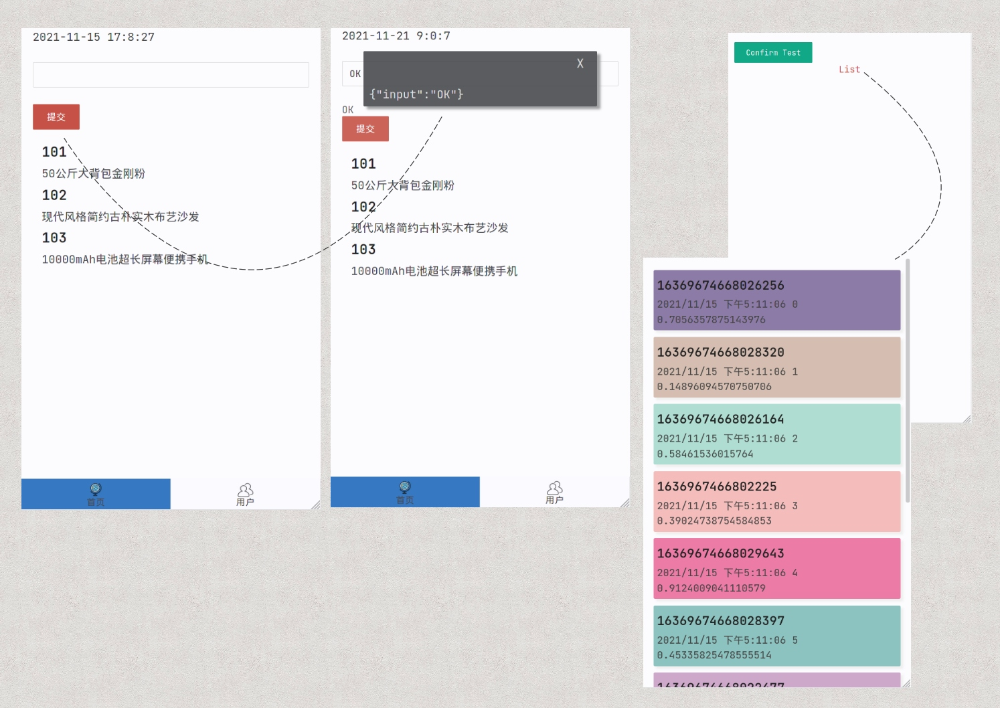

## wight

只是为了方便自己使用的一个前端小框架，前端热门的react、vue等，我一概不会，并且实在是不想去学这些东西。我主要是开发后端服务以及Linux运维和服务管理相关的工具。可是又离不开前端应用，于是便有了此框架。

这个框架的参考了一点小程序的设计，只是从简单的功能和目录结构上，代码并未参考。因为我讲过《微信小程序和公众号接口开发》的课程，所以为了在前端也能使用类似的形式做了一点尝试。

所有的渲染都是采用的模板字符串，动态的渲染都是采用js，通过编写js代码来控制，而html则可以通过属性声明进行控制。多年以前，还在使用PHP开发时，涉及到不得不自己开发前端页面，探索过一些单页的方案，可用但不好，当时JS水平也仅仅限于能用而已，并未过多涉及前端，后来面对的规模变大，参考过《单页Web应用——JavaScript从前端到后端》这本书，这是一本翻译教材。其中的方案也是字符串拼接的形式。后来的模板字符串功能功能强大且易用，综合这些因素，设计了一个不是很符合主流思想的框架。

它具备以下特点：

- 没有虚拟DOM，虚拟DOM其实问题也很多。

- 目前的前端API基本统一，尽可能使用浏览器的原生API。

- 绝大部分情况下使用封装模板字符串的函数进行HTML渲染。

- 提供onload、onshow、onhide、onunload、onscroll、onbottom、onresize事件函数支持。

- 每个页面是独立的目录，存在对应的.js, .html, .css文件。

- 使用config.json进行项目的配置。

- 监听hashchange进行页面切换。

- 所有页面的切换都不是真的切换，只是通过css来控制显示和隐藏。

- w是全局对象，提供了很多组件和功能函数。

- alert、confirm、prompt被重写为新的组件，可以提示信息，还可以作为弹出层提供复杂的交互功能。

- 提供一个sliderPage功能，用于显示任何需要的内容，可用于复杂交互。

- 通过w.comps挂载所有组件，在config.json中配置需要启用哪些组件。

- 通过config.json配置直接可以启用底部菜单栏，方便移动端开发。

- 静态资源都统一放在 _static 目录中，访问路径以static开头，也可以_static开头。


在目前来说确实有些特立独行，并且这不是一个为广泛使用而准备的框架。所以文档也不会很全面。而创建项目和页面的方式是通过命令，直接通过浏览器运行即可进行测试。


在这有点怪异的小框架中，w是一个全局对象，提供很多接口和组件，比如，页面的切换是w.loadPage负责的，但是你不应该自己去调用这个接口。

项目的目录结构：

- _comps/ 各个组件放在此目录下。

- _static/ 静态资源目录，但是引入路径以static开头。

- config.json 项目配置文件。

- app.css 全局css样式，其实在每个页面中的css仍然是全局存在的。

- [PageName]/ 每个页面的目录，比如 home、user。

在页面目录下，以home页面为例，存在以下文件：

- home.js

- home.html

- home.css

.js文件会处理所有的逻辑以及模板字符串的拼接和渲染处理。.html中的标签，通常以data-*自定义属性的方式声明要绑定的数据以及要处理的方式：

- data-insert 默认为replace，可以是before或end表示在节点以前或之后插入数据。

- data-bind 绑定data属性上的数据，例：

```javascript
/*
.html中<div data-bind=xyz data-map=renderList></div>。

在.js中，通过this.bind.xyz = ['abc', 'def']就会渲染到节点。

而data-map控制着要把数据给谁渲染，此时在.js中要存在renderList函数。

renderList函数中会接收到参数
  {
    data: DATA,
    target: DOM,
    type: 'map',
    dataType : (typeof data)
  }

*/

renderList(d) => {

  let htext = ''

  d.data.forEach(a => {
    htext += `<p style="color:#4a4a4f;font-size:95%;line-height:150%;">${a}</p>`
  })

  return htext

}

```

### 效果




### 初始化项目

```javascript
//新建一个first项目，会在当前目录下的apps目录中创建项目
node createproject.js first
```

此时，会在当前目录下创建apps目录，apps是applications的缩写。里面每一个项目都是一个目录。


### 启动测试

```javascript
node app
```

此时会加载apps目录下的所有项目，和其他框架不同的是，在开发测试期间，你可以在同时直接加载多个项目。默认的服务运行在1211端口。浏览器访问方式：

```
http://localhost:1211/first
```

first是项目的名字。

### 构建项目

```javascript
node build.js first
```

这会在apps/first中创建first.html文件，这个项目中的_static等静态资源都是有用的，不要随便改动和删除。并且要把构建后的文件和静态资源目录都一起打包部署到正式环境。

这种设计的原因有：

- 最初的设计没有考虑构建问题，仅仅是有一个想法并进行实践。

- 后来增加功能考虑到要保证开发测试时能使用同时还要支持多个项目，这需要一个灵活的设计和统一的目录结构。

- 在构建项目后，保证不更改路径以及静态资源路径即可使用，也要允许通过config.json设置构建项目的静态资源前缀路径。

- 项目打包到正式环境后，不需要频繁修改静态资源目录，并且每个不同的项目还可以有单独的静态资源路径，互不影响。（这个功能其实需要后端在静态资源处理和路由设计上进行配合才可以）

### 创建新的页面

```javascript

node newpage.js first userinfo register

```

对first项目创建userinfo和register页面。

### 页面js对象中可以直接调用的接口

w是全局存在的对象，可以直接调用其接口，此外，对页面自身来说，js代码中可以调用的接口有：

**view**

```javascript

/**
 * 在html文件中，存在如下代码：
 * <div data-name=list data-list=showList></div>
*/

/*
  data-list表示要渲染一个数组，此时会进行forEach调用，接收函数会收到三个参数：
    a : 每个数组元素；ind：元素的索引数字；nod：当前要渲染的dom节点对象
*/
this.showList = (a, ind, nod) => {
  return `<li style="color:#4a4a4f;">${ind + 1}. ${a}</li>`
}

this.view({
  list: [
    'Ubuntu', 'Debian', 'FreeBSD', 'OpenBSD', 'Deepin', 'Arch', 'Manjaro'
  ]
})

```

**setAttr**

设置节点属性的值。

```javascript

//.表示是class，和[class=xxx]效果一致，设置class为box的节点新的class属性为darkox。
//同时设置内联样式，这会自动设置节点的d.style.cssText属性，而如果style为一个对象则会设置style中的每个属性值。
this.setAttr({
  '.box' : {
    class : 'darkbox',
    style : 'font-size:158%;'
  }
})

```

### config.json的完整配置项

```javascript
{
    "title" : "新项目",
    "pages" : [
        "home",
        "user",
        "test",
        "list"
    ],

    "host" : "https://www.a.com",

    "testHost" : "http://localhost:2022",

    "tabs" : {
        "background" : "#fafaff",
        "selectedBackground" : "#3678c1",
        "list" : [
            {
                "page" : "home",
                "icon" : "static/icon/home.png",
                "name" : "首页"
            },
            {
                "page" : "user",
                "icon" : "static/icon/user.png",
                "name" : "用户"
            }
        ]
    },

    "buildPrePath" : "",

    "cssurl" : [
        "/static/css/mini-nord.min.css"
    ],

    "jsurl" : [],

    "jsbottom" : [],

    "components" : "*",

    "version": "1.3",

    "radius" : true,

    "debug": true,

    "animation": true,

    "closePrompt": false,

    "buildCompress": false
}
```

- tabs是底部标签，若不需要，可以把list属性设置为空数组，tabs属性可以保留。

- components是要启用的组件，组件在_comps目录下，\*表示启用所有组件，但是如果文件名以!开头则表示不启用，会忽略。如果指定部分组件，使用数组形式：

```
"components" : [
  "login", "checkToken", "confirm"
]
```

文件名字就是这里的组件名称，不需要加.js。

- debug为true表示调试模式，不会进行代码压缩。

- buildCompress为true表示构建项目时会进行压缩。

- buildPrePath 是构建项目时，静态资源的路径前缀，是给配置文件中指定的cssurl、jsurl、jsbottom使用的。

- cssurl、jsurl、jsbottom是要引入的资源路径，jsbottom表示js文件在最后引入，避免网络延迟造成的应用异常。

- radius为true表示启用组件的圆角。

- animation为true表示启用组件的显示动画效果。

- version表示要使用的w版本。

- pages第一个表示主页，pages是要启用的页面，不在这里的页面不会进行加载和构建，自然也不会有此页面。

### data-*控制

在html文件中，data-*属性：

- data-bind指明要和哪个数据绑定，在js文件中，通过this.bind来渲染数据。

- data-map和data-list指明当渲染数据时要调用的函数。区别在于，data-list指明的函数，在传递数据时，若数据是Array或Object则会循环并反复调用，否则data-list和data-map效果一致，data-map指明的函数，直接调用传递数据。

HTML文件

```html
<div data-bind=users data-list=renderUser></div>
```

JS文件

```javascript

let userList = [
  //...
];

exports.user = new function () {
  //...

  this.onload = function (p) {
    this.bind.users = userList;
  };

  /**
   * u包括属性：
   *    data 数组元素
   *    index 索引，若是Object则没有此属性
   *    key   索引，若是Object则为键值。
   *    target dom节点。
   *    type  map或list
   *    dataType 数据类型。
   * */
  this.renderUser = function (u) {
    let htext = '';
    //一些渲染处理
    return htext;
  };

  //...
};

```

- data-on*可以指定各种事件，比如data-onclick。html默认的onclick属性仍然是可用的，以data-on这种方式声明，会通过w.eventProxy进行代理并调用对应的函数，会进行一些数据的处理然后传递一个包装后的参数给真正的事件触发函数。

#### data-map和data-list指定的函数接收的参数

```javascript
{
  data: DATA,
  target: NODE,
  index: INDEX,
  key: KEY,
}
```

#### data-on*事件函数接收的参数

```javascript

//data和value指向的是同一个值，为的是和data-map指定的函数参数访问一致。
{
  data: DATA,
  value: DATA,
  target: NODE,
  currentTarget: PARENT_NODE,
}


```
