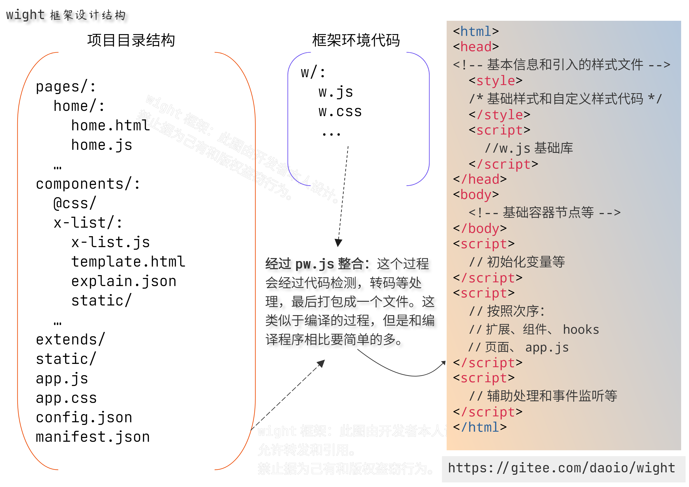

<!--name:框架设计-->
# 框架整体设计



pw.js的角色类似于编程语言的编译器，只是这个过程没有编译处理那么复杂。

如果你从来没有开发过前端应用，或者说，你只接触过简单的页面开发，那么首先要转变的是思维模式：

**现在前端的开发模式都转向了组件、模块的拆分，并利用开发工具进行编译打包。**

**也就是说，你不能像以前一样写个页面直接就可以用，而是要利用框架和相关的配套工具，还要启动一个本地服务进行编译打包等一系列处理，然后在浏览器访问一个url查看应用效果并进行调试。**

> wight框架鼓励使用浏览器的标准API，只有在有必要的时候才会封装一些API，但尽管如此，还是会有很多复杂的功能被设计出来。
> 这也跟现在的浏览器设计有关，一切都难以达到完美，并且当今浏览器设计都需要新的模式。可是这在很长时间内都无法完成。

整体设计和当前主流的方式不同，它主要特点如下：

- 没有虚拟DOM，虚拟DOM其实问题也很多。目前的前端API基本统一，尽可能使用浏览器的原生API。

- **单向数据绑定，提供了view方法用于数据渲染，大部分不必进行dom操作。**

- 支持并且鼓励在特殊情况下使用DOM标准API。

- 事件响应函数接受的参数直接带有对应的DOM节点，可以直接进行DOM操作。

- 使用封装模板字符串的函数进行HTML渲染。

- 提供onload、onshow、onhide、onunload、onscroll、onbottom、onresize等事件函数支持。

- 每个页面是独立的目录，存在对应的.js, .html, .css文件(注意这里css文件没有域的支持)。

- 使用config.json进行项目的配置。监听hashchange进行页面切换。

- **所有页面的切换都不是真的切换，只是通过css来控制显示和隐藏。**

- **w是全局对象，提供了很多组件和功能函数。**

- alert、confirm、prompt被重写为新的组件，可以提示信息，还可以作为弹出层提供复杂的交互功能。

- 通过w.ext挂载所有扩展，在config.json中配置需要启用哪些扩展。

- 在config.json中配置需要启用哪些组件。

- **提供require在ext中用于导入扩展（require是异步操作，需要await require，直接写require也可以，会被替换成await require）。**

- **通过config.json配置直接可以启用底部菜单栏，方便移动端开发。**

- 静态资源都统一放在 static 目录中，组件的静态资源统一放在static/components目录。

- **提供了w.share用于数据共享，使用w.registerShareNotice和w.removeShareNotice注册和移除共享数据通知函数。**

- **w.share用于解决全局数据共享和通信的问题，并且利用各种数据变化的事件函数完成复杂逻辑的解耦。**

**一个重要的设计：wight充分利用浏览器的自定义属性data-\*，你可以使用data-on[事件名称]进行事件绑定。比如：**

```html
<div data-onclick="clickHandle">OK</div>
```

## 相关重要改进的记录

- 在2.9的之前版本上，对页面的初始化使用的是pw.js在构建应用时，注入的代码，在这之后全部放在了w.js中，并调整了一些需要在初始化之前就要存在的dom节点，放在了开始的位置。

- 加载页面的过程，如果此时页面还没有准备好，则会提示一个正在初始化的提示，并进行等待，直到准备好或超时。

- w.go和w.redirect在异步处理的代码中，或者是在钩子函数中运行，此时若listenHashLock为true会导致失败，进而导致页面显示白板，2.9以后改为若检测到处于锁定状态则会等待，直到解锁或超时，无论是正常解锁还是超时都会执行listenHash()。

- w.loadPage()函数中在初始化相关处理完成后，准备执行onload和onshow事件函数之前，会把listenHashLock设置为false，此时若因为onload和onshow执行时间过长，导致listenHash等待，再次执行listenHash，不会导致失败。

- 组件层面使用this.attrs代理内部的this.\_\_attrs\_\_，利用代理机制，在使用this.attrs更改属性时也会触发onattrchange事件函数，组件的init可以是async function声明的函数，并在初始化时会等待其执行完毕再继续执行后续操作。
